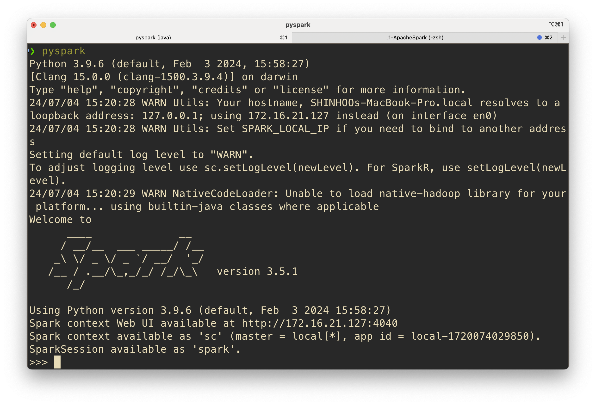

# Apache Spark

Date: September 7th, 2024

<!-- Create a virtual environment. `python -m venv .venv`

Activate the virtual environment. `source .venv/bin/activate`

Deactivate the virtual environment. `deactivate` -->

## Install 

### Mac

```bash
pip install pyspark
```

If this doesn’t work, check if `JAVA` is properly installed.
```bash 
java --version
```
If not, install the JDK through `brew install openjdk@11`.

When PySpark is initialized, it launches a Java Virtual Machine (JVM) process to run the Spark runtime. This runtime includes key libraries such as Spark Core, SQL, Streaming, MLlib, and GraphX.


### Windows Subsystem for LINUX (WSL2)

PySpark was not installed correctly using `pip`.
```bash
pip install pyspark
```

Instead, we will use the pre-built version of PySpark.


Make sure `JAVA`, `SCALA`, and `py4j` are installed. 
Spark 3 is pre-built with Scala. 
PySpark includes `py4j`, which enables Python to interact dynamically with JVM objects.

Try the following:
```bash
java --version 
scala -version
pip list | grep 'py4j'
```

If one of them is not installed, follow these steps first. 
```bash
sudo apt update
sudo apt upgrade
```
The first command updates the list of available packages, 
while the second upgrades the installed packages to their latest versions.

To install `JAVA`, follow these steps.
```bash
sudo apt-get install openjdk-11-jre
sudo apt-get install openjdk-11-jdk
```

To install `SCALA`, follow the step.
```bash
sudo apt-get install scala
```

To install `py4j`, follow the step.
```bash
pip install py4j
```


#### Manually Set Up PySpark

1. Download the release `spark-3.5.2-bin-hadoop3.tgz` from https://spark.apache.org/downloads.html.

<!-- ```bash
curl https://archive.apache.org/dist/spark/spark-3.5.2/spark-3.5.2-bin-hadoop3.tgz --output spark-3.5.2.tgz
``` -->
```bash
wget https://archive.apache.org/dist/spark/spark-3.5.2/spark-3.5.2-bin-hadoop3.tgz
```

2. Unpack the downloaded Spark distribution
```bash
tar -xvf spark-3.5.2-bin-hadoop3.tgz
```

3. Set environment variables for Spark.
Add the following to `~/.bashrc`
```bash
export SPARK_HOME=/home/pepc/work/course410/02-ApacheSpark/spark-3.5.2-bin-hadoop3
export PATH=$PATH:$SPARK_HOME/bin
```
Note that you correctly modify 'SPARK_HOME' environment variable on your machine. 

4. Source the Bash script file.
```bash
source ~/.bashrc
```

5. Check PySpark version
```bash
pyspark --version
```


## Run PySpark

Type `pyspark` in a shell. 
Spark shell is ready.



## Quickstart 

Use Apache Spark examples.
[DataFrame](https://spark.apache.org/docs/latest/api/python/getting_started/quickstart_df.html)
[Spark Connect](https://spark.apache.org/docs/latest/api/python/getting_started/quickstart_connect.html)
[Pandas API on Spark](https://spark.apache.org/docs/latest/api/python/getting_started/quickstart_ps.html)

